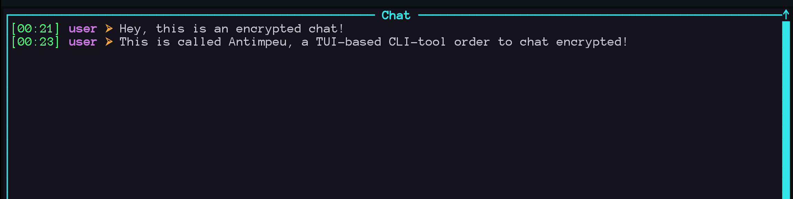

# Antimpeu

Compact, auditable encrypted group chat with a terminal UI (TUI).

Antimpeu is a single binary that provides AES-256-GCM-encrypted group messaging for small trusted networks. Use the lowercase subcommands: `server`, `client`, and `enc`.

Quick start

Make sure that [Rust](https://rust-lang.org/learn/get-started/) is installed on your System

Build & install

```sh
cargo build --release
# binary: target/release/antimpeu
cargo install --path .
```


1. Generate a temporary 32-byte DEK and protect the key material locally:

```sh
mkdir -p "$HOME/key"
openssl rand 32 > "$HOME/key/dek.key"
chmod 700 "$HOME/key" && chmod 600 "$HOME/key/dek.key"
```

2. Create an encrypted DEK and remove the raw key so only the encrypted blob remains:

```sh
antimpeu enc
# follow the prompt to set a passphrase (KEK)
rm -f "$HOME/key/dek.key"   # remove the raw DEK; keep dek.bin only
```

3. Start the server (default examples use port 5000) and connect a client:

```sh
antimpeu server 5000
antimpeu client 127.0.0.1 5000
```



```sh
cargo build --release
# binary: target/release/antimpeu
cargo install --path .
```

Key management (brief)

- `$HOME/key/dek.key` — raw 32-byte DEK (temporary; remove after running `antimpeu enc`).
- `$HOME/key/dek.bin` — encrypted DEK used by server and client at runtime.

`antimpeu enc` reads `dek.key`, prompts for a KEK, derives a key with PBKDF2(HMAC-SHA256, 100k iterations) and writes `dek.bin` as: `salt(16) || nonce(12) || ciphertext`.

At runtime `server` and `client` prompt for the KEK and decrypt `dek.bin` to obtain the 32-byte DEK. Keep `$HOME/key` restricted (e.g. `chmod 700 $HOME/key` and `chmod 600 $HOME/key/dek.*`).

Run

Server:

```sh
antimpeu server <port>
```

Client:

```sh
antimpeu client <server-ip> <port>
```

Protocol summary

- Handshake: client sends plaintext `HELLO-ANTIMPEU`; server responds `CHAL:<hex>`; client returns the challenge encrypted under the shared DEK.
- Framing: 4-byte big-endian length prefix + frame bytes (applies to plaintext control frames and encrypted JSON frames).
- Encrypted message JSON: `{ "username": "alice", "nonce": "<hex>", "ciphertext": "<hex>", "tag": "<hex>" }`.
- `dek.bin` layout: `salt(16) || nonce(12) || ciphertext`.

TUI controls

- Tab — toggle input focus
- Enter — send (when input focused)
- Backspace — edit input
- Up/Down or mouse wheel — scroll history
- Esc — quit

Security notes

- AES-256-GCM for authenticated encryption.
- KEK derived with PBKDF2(HMAC-SHA256, 100k iterations). Use a strong passphrase.
- No forward secrecy; rotate the DEK to invalidate previous ciphertexts.
- Restrict access to `$HOME/key/*` and prefer trusted networks or an encrypted transport for untrusted networks.

Development

- Rust 2021. Key crates: `aes-gcm`, `pbkdf2`, `crossterm`, `ratatui`, `clap`.
- Important files: `src/main.rs`, `src/server.rs`, `src/client.rs`, `src/tui.rs`, `src/crypto.rs`, `src/auth.rs`, `src/utils.rs`.

Examples

Start a local server and a client on the same host (uses port 5000):

```sh
antimpeu server 5000
antimpeu client 127.0.0.1 5000
```

## License

This project is available under the MIT License — see `LICENSE`.
